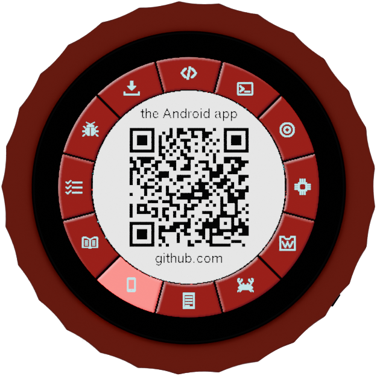
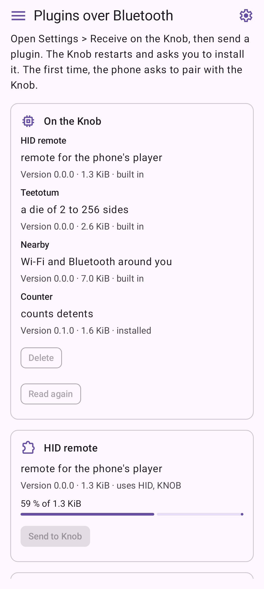

```{=typst}
#pagebreak()
```

# What TeeToTum is

This manual is for the **Waveshare ESP32-S3 Knob Touch LCD 1.8** running TeeToTum: a round
360 x 360 touch screen with a rotary knob around it. The manual calls the whole device **the Knob**,
with a capital K, and the ring you turn **the knob**.

**TeeToTum** is an open-source firmware that replaces the factory demo on the Knob. A teetotum is a
spinning top you turn between thumb and forefinger, which is how you use the device: you turn the
knob and touch the screen. The **TeeToTum app** for Android reads and writes the Knob's memory card
over Wi-Fi and talks to the Knob over Bluetooth.

## Two chips on one board

The board carries two microcontrollers, and this explains most of what TeeToTum can and cannot do:

- The **ESP32-S3** runs TeeToTum. It owns the touch screen, the knob, the vibration motor, Wi-Fi
  and Bluetooth Low Energy.
- The **second chip**, a classic ESP32, keeps its factory firmware. It owns Bluetooth audio, the
  sound output and a Bluetooth remote-control function. TeeToTum asks it over a wire inside the
  board to play, pause, skip and change the volume.

## What it does

- Menus drawn as a ring of twelve segments around the round screen, worked with the knob and the
  touch screen, with clicks you feel from the vibration motor.
- Music from your phone through the second chip: title, artist, cover and volume on the screen,
  play and pause with a tap, previous and next track with a swipe, volume with the knob.
- Four picture orientations, eleven colour themes, ten brightness steps, and a background of points
  in the colours of the theme, still or moving.
- The memory card (TF card) read and written from a phone or computer over Wi-Fi.
- Plugins: small add-on programs that each get a screen of their own. Three come with the firmware,
  more can be sent from the app.
- Settings that survive a restart, and firmware updates over Bluetooth.

## What not to expect

- **No internet.** The Knob runs a Wi-Fi network of its own for Card over Wi-Fi, but never joins
  one.
- **No sound of its own.** What you hear is your phone's music, played by the second chip.
- **No battery gauge.** If your Knob has a battery, TeeToTum does not show how full it is.
- **The factory demo is gone** from the ESP32-S3. Its pictures stay on the memory card, but
  TeeToTum does not use them.
- **The knob cannot be pressed.** It only turns. Everything that works like a button is done on
  the touch screen.

## What you need

- The Knob, and a USB-C cable to a computer.
- For installing the firmware: a computer with desktop **Chrome, Edge or Opera**.
- For the app: an Android phone with **Android 10 or later**.
- For music: a phone with Bluetooth. For Card over Wi-Fi: a microSD card in the Knob.

If you want to build the firmware, the app or a plugin yourself, the source code and the guides
for developers are at `github.com/teetotum-rs` (repositories `firmware`, `app` and `plugins`).

# Installing the firmware

The **web installer** writes the latest TeeToTum release to the Knob from the browser. You do not
need to install any tools. Only the ESP32-S3 is written, never the second chip.

## The plug decides which chip you reach

Which of the two chips is connected to USB depends on **which way round the USB-C plug is
inserted** in the Knob. The installer needs the ESP32-S3, which appears as
`USB JTAG/serial debug unit`. If that name is not in the browser's list, pull the plug out, turn it
over and plug it in again.

## Installing

1. Connect the Knob to the computer with the USB-C cable.
2. Open **`https://teetotum-rs.github.io/firmware/`** in desktop Chrome, Edge or Opera. Firefox
   and Safari cannot talk to serial ports.
3. Press **Connect and install** and pick `USB JTAG/serial debug unit`.
4. On the very first install, the installer offers to erase the device. That clears the whole
   flash memory and is the clean start after the factory demo.
5. Writing takes about half a minute.

Installing again later keeps your settings and the plugins you installed. The same page also
installs every new release; once TeeToTum runs, you can update it over Bluetooth with the app as
well (see [Firmware over Bluetooth](#firmware-over-bluetooth)).

## The first start

1. Without a battery, the Knob needs the USB-C cable to a charger or a computer. With a battery it
   also runs without the cable, and the cable charges it.
2. Switch it on with the power switch.
3. **The screen stays dark for a moment.** There is no boot screen: the backlight comes on with the
   first picture, and that picture is Home.
4. **On the very first start, the motor buzzes once.** It calibrates itself; later starts are
   quiet.

The Knob starts at Home every time. To switch it off, use the power switch; there is no shutdown
step, because settings are stored at the moment you confirm them.

Going back to the factory demo is possible with a backup of the original flash; the firmware
repository describes it for people who flash from the command line.

# Using the Knob

## The gestures

| You do | Where | What happens |
|----------|-----------|--------------------------|
| **Turn the knob** | in a menu | The selection moves one entry per detent. |
| | in an open setting | The value changes, one step per detent. |
| | on the Music Player | The volume changes. |
| | on a plugin's screen | The plugin gets the turn if it uses the knob; otherwise the knob keeps working the volume. |
| | on a QR code | Shows the next code. |
| **Tap** a segment | in a menu | The first tap selects the entry, a second tap opens it. |
| **Tap** the middle | in a menu | Opens the selected entry. |
| **Tap** | on the Music Player | Play or pause. |
| **Swipe** left or right | on the Music Player | Previous or next track. |
| **Long press** | anywhere but Home | Goes to Home. |
| | on Home | Opens the QR codes. |

**Long press** means resting a finger on the screen for about 0.6 seconds without moving it. You
feel a click while the finger is still down, and Home appears. This works on every screen, in every
menu and inside every plugin; no plugin can switch it off. **In an open setting a long press
cancels first**: the value goes back to what it was, then Home appears.

**A swipe** has to travel at least about a tenth of the screen; a shorter movement counts as a tap.
Swipes count in the directions of the picture as you see it, however you have turned it.

## How the menus work

Every menu is a **ring of twelve segments** around the edge of the screen, like the hours on a
clock face. Occupied segments carry an icon and stand slightly raised, like keys; empty segments
are flat and cannot be selected.

- **Names are not written in the ring.** The selected entry's name stands large in the middle, the
  menu's title small above it and the entry's current value below it. Under that stands
  `tap menu entry to open`.
- **The top segment marks "up".** In every menu About sits at twelve o'clock; at Home, the Home
  entry does. When you turn the picture, this segment turns with it.
- **Tap once to select, tap again to open.** Tapping the middle opens whatever is selected.
- **Every detent is one entry.** Turning clockwise selects the next entry round the ring, and empty
  segments are skipped. The knob clicks whenever the selection moves.
- **A full ring runs on to a second page.** A row of dots under the top segment then shows how many
  pages there are, the page you are on lit. The knob walks on across the pages: past the last entry
  of one page it moves to the first entry of the next. The Settings have two pages from the start.

{width=38%}

**Buttons** are icons: a **tick** means OK, a **cross** means Cancel.

- **One level below Home** (the Settings, for example) there is no tick. The menu says
  `hold for home` instead, because a long press is the way back.
- **In a deeper menu** a tick below the name goes back up one level.
- **In a setting you can change**, the cross stands on the left and the tick on the right. The knob
  changes the value and you see the result at once. The tick keeps and stores the new value; the
  cross puts back the old one.
- **In a setting that only shows something** (every About) there is only the tick.

## "hold for home"

The Music Player and every plugin screen show `hold for home` at the bottom. TeeToTum writes this
itself on top of every screen, so no plugin can cover it. It always means the same thing: a long
press takes you to Home.

**Clicks.** The motor clicks under a tap that does something, under a long press, when the
selection in a ring moves, and under every detent in an open setting, on the Music Player and on a
plugin's screen. With Haptics set to `Off` nothing clicks.

# Home and the QR codes

Home is where the Knob starts and where a long press leads from every other screen. The menu's
title is `TeeToTum`.

- **Left of Home is the firmware:** the gear (`Settings`) at eleven o'clock, `Card over Wi-Fi` at
  ten and the `Music Player` at nine.
- **Right of Home are the plugins**, one per segment from one o'clock on: `HID remote`, `Teetotum`
  (a die) and `Nearby` come with the firmware. A removed plugin leaves no gap; the plugins after it
  move up.
- Home has no tick: there is nothing above it. Where other menus have OK, Home says
  `hold for QR codes`.

{width=38%}

The line under the name shows the state of the selected entry:

| Selected | The line shows |
|--------|---------------------------|
| Home | where the firmware's source lives: `teetotum-rs/firmware` on GitHub |
| Settings | theme and brightness, the angle if the picture is turned, `silent` if clicks are off, `moving` if the background moves |
| Music Player | the title that is playing, or `nothing playing` |
| Card over Wi-Fi | the size of the card found at start-up, or `no card` |
| a plugin | the plugin's one-line summary, or `stopped` after it failed |

## QR codes

A long press on Home opens a ring of QR codes. Use them when someone asks where to get the hardware,
the firmware or the app: open the code and let them scan it with their phone's camera.

| Segment | Leads to |
|----------|---------------------------|
| 12 `TeeToTum` | the firmware and its documentation |
| 1 `Claude Code` | the AI coding agent the firmware was written with |
| 2 `Waveshare` | the hardware's wiki page, which links on to where the board is sold |
| 3 `Espressif` | the maker of both chips on the board |
| 4 `wasmi` | the WebAssembly runtime the plugins run in |
| 5 `esp-rs` | the Rust projects the firmware is built on |
| 6 `Author's blog` | the author's blog |
| 7 `App` | the latest release of the TeeToTum app for Android |
| 8 `Plugin guide` | the guide to writing a plugin |
| 9 `Code quality` | the checks a change to the firmware must pass |
| 10 `Issues` | where to report a problem with the firmware |
| 11 `Web installer` | the web installer |

- **A first tap selects a segment, a second one opens its code.** The code fills the middle of the
  screen, black on white, with the site it leads to below it. While a code is open, the screen is
  at full brightness so that a camera reads it easily.
- **Turning the knob shows the next code.** A tap on the code closes it, a long press goes back to
  Home.
- **The codes are plain links:** nothing is counted, and no place in the ring is paid for.

{width=38%}

# Settings on the Knob

Open the Settings from Home: select the gear at eleven o'clock and tap it again. Clockwise from
About at the top stand `Orientation`, `Theme`, `Brightness`, `Haptics`, `Background` and `App`,
then one entry per plugin, then the `Music Player` menu at ten o'clock and `Card over Wi-Fi` at
eleven. `Receive`, which takes a plugin or a firmware over Bluetooth, stands after the last plugin:
with the three bundled plugins that is one o'clock of the **second page**, reached by turning the
knob on past Card over Wi-Fi.

While an entry is selected, its current value stands under its name, so you can read every setting
without opening it.

## Changing a setting

1. Select the entry and tap it again. The setting opens.
2. Turn the knob. **The change shows at once**: the picture turns, the colours change, the screen
   gets brighter, the clicks get stronger.
3. Tap the **tick** to keep it, or the **cross** to put back the old value. A long press does the
   same as the cross, then goes to Home.

A setting is stored when you tap the tick, and only then. It survives switching off.

| Setting | Values | Default |
|------------|-------------------|-----|
| Orientation | `0 deg`, `90 deg`, `180 deg`, `270 deg` | `0 deg` |
| Theme | `Teal`, `Orange`, `Magenta`, `Violet`, `Blue`, `Pink`, `Red`, `Green`, `Cyan`, `Indigo`, `Grey` | `Red` |
| Brightness | `10 %` to `100 %` in steps of 10 | `100 %` |
| Haptics | `Off`, then `1 / 9` to `9 / 9` | `9 / 9` |
| Background: Motion | `Still`, `Moving` | `Still` |
| Background: Points | `100` to `5000` in steps of 50 | `2450` |
| Background: Brightest | `10 %` to `100 %` in steps of 2 | `98 %` |
| Background: Dark centre | `0 px` to `130 px` in steps of 5 | `0 px` |
| Background: Icon colour | `0 %` to `100 %` in steps of 5 | `40 %` |
| Music Player: Cover | `Sharp`, `Full screen` | `Sharp` |
| Installed (per plugin) | `Yes`, `No` | `Yes` |

- **Orientation** turns the picture in quarter turns, so you can use the Knob in any position.
  About always stands at the top of the picture, and touch follows the picture.
- **Brightness** and **Haptics** stop at both ends instead of going round. The darkest brightness
  step is dim, not off. With Haptics `Off`, nothing clicks anywhere, not even a plugin's pulse.
- **Background** is a menu of its own for the cloud of points behind Home, the menus and the Music
  Player. `Moving` turns the whole cloud once in two minutes and lets every point breathe.

## About

The value under About in the ring is the **firmware version**, for example `v0.4.0`. Opening it
shows the licence, `up ... s` (seconds since start), `wi-fi ... nets` (networks the last scan
found; TeeToTum only counts them), `ble advertising` or `ble connected` (whether a device such as
the app is connected over Bluetooth) and `knob ...` (detents counted since start).

## App

`App` at six o'clock is about the phone that talks to the Knob over Bluetooth, such as the TeeToTum
app. The Knob keeps a pairing with **one** phone; a new pairing replaces it.

- **About** shows `paired` and the phone's address, or `no phone paired`, and whether it is
  `connected`.
- **Forget phone** removes the pairing when you tap the tick. The app pairs anew the next time it
  connects.

## Plugin entries

Each plugin has an entry in the Settings. It opens the plugin's own menu, which does **not** start
the plugin:

- **About** shows the plugin's name, `bundled with the firmware` or `from slot` and its number, its
  size, the rights it asks for, and whether it is `loaded`, `not loaded` or `stopped`.
- **Installed** is `Yes` or `No`. The dialog adds `OK restarts`: the tick saves the choice and
  restarts the Knob. With `No` the plugin leaves Home but stays on the Knob, so you can set it back
  to `Yes` at any time.
- **Main Settings** leads back to the firmware's Settings.

## Receive

`Receive` opens a dialog that takes **one plugin or one firmware file** over Bluetooth. It says
`plugin or firmware`, `waiting for a sender` and `visible as TeeToTum`, the name the Knob announces
over Bluetooth. **The Knob accepts a plugin, a firmware or a request to delete a plugin only while
this dialog is open.** The cross closes it. What happens next is described in
[Plugins](#plugins) and [Firmware over Bluetooth](#firmware-over-bluetooth).

# Music Player

The Music Player shows what your phone is playing and lets you control it. Open it from Home at
nine o'clock.

## Pairing your phone

The Music Player works through the second chip, so your phone has to be connected to **that chip
as an audio device**:

1. On the phone, open the Bluetooth settings and search for new devices.
2. Pair **`TAIJI_KNOB_AUDIO`**.
3. Play music on the phone. The sound now comes out of the Knob's 3.5 mm headphone jack, and title,
   artist, volume and cover appear on the screen.

Everything on this screen travels over that audio connection. If the phone is not connected as an
audio device, taps and swipes do nothing and no title appears; there is no error message, because
the second chip does not report one.

The Knob can appear under three Bluetooth names:

| Name | What it is for |
|---------|---------------------------|
| `TAIJI_KNOB_AUDIO` | Audio. **Pair this one** for the Music Player. |
| `TAIJI_KNOB_HID` | A Bluetooth remote control for the phone, used by the `HID remote` plugin. |
| `TeeToTum` | The Knob's own Bluetooth service, used by the app. It does not appear in the phone's Bluetooth settings, only in apps; that is expected. |

## Using the player

{width=38%}

| You do | What happens |
|-----------------|---------------|
| Tap | Play or pause. |
| Swipe right / left | Next / previous track. |
| Turn the knob clockwise / anticlockwise | Louder / quieter. |
| Long press | Home. |

- **The volume** runs round the rim as an arc. It only moves while music is streaming to the Knob;
  when the phone pauses, the **arc turns dim** to show that turning does nothing.
- **Play and pause** depend on the second chip: if it does not know whether the phone is playing,
  a tap sends nothing. Start playback on the phone, then taps work.
- **The cover** comes from the phone at 200 x 200 pixels, requested when the track changes; after
  connecting, the first cover may only appear with the next track. `Music Player` > `Cover` in the
  Settings shows it `Sharp` in the middle or enlarged to `Full screen`.
- **Long titles** scroll once to their end, then stay at their start, shortened with `...`.

# The TeeToTum app

The TeeToTum app for Android works the Knob from your phone: it reads and writes the memory card
over Wi-Fi, and over Bluetooth it shows the Knob's status, sends plugins, changes the Knob's
settings and updates its firmware.

## Installing the app

1. On the phone, open the app's release page: scan the `App` code at seven o'clock of the Knob's
   QR ring, or go to **`github.com/teetotum-rs/app/releases/latest`**.
2. Download `teetotum-app-vX.Y.Z.apk` and open it. Android asks once to allow installs from the
   browser or file manager; allow it, then install.
3. The file `SHA256SUMS` on the same page lists the file's checksum, if you want to check the
   download.

The app needs **Android 10 or later**. Use it with the latest firmware: where the Knob's firmware
is too old for a page, the app says so and asks you to update it.

## Finding your way in the app

**Home** shows a card for each feature: Card over Wi-Fi, Status over Bluetooth, Plugins over
Bluetooth, Knob settings over Bluetooth and Firmware over Bluetooth. Tap a card to open it.

The button at the top left opens the **menu** with every page of the app. **Home** and **About**
have their pages indented under them; the arrow at the end of each folds them away. **Settings**
(also the gear at the top right) and **Exit** stand at the end. The back gesture leads to the page
above: from a page under About to About, from any other to Home.

```{=typst}
#figure(
  grid(columns: 2, column-gutter: 6mm,
    image("manual/images/app-home.png", width: 46mm),
    image("manual/images/app-menu.png", width: 46mm)),
  caption: [The app's Home with a card for each feature (left), and the menu (right).],
)
```

# Card over Wi-Fi

`Card over Wi-Fi` lets the app, or any browser, read and write the memory card inside the Knob
without opening the housing. **While its dialog is open, the Knob runs a Wi-Fi network of its
own.**

## On the Knob

Open `Card over Wi-Fi` from Home at ten o'clock (or from the Settings at eleven). The line under its
name shows the card, for example `14.8 GB card`, or `no card`.

- **A QR code joins the network.** The network's name stands above it and `192.168.4.1` below.
- **Turn the knob for the same in words**, for a computer without a camera: the network's name,
  the password and the address. Turning again brings the code back.
- **The name is `TeeToTum-` and four hex digits**, so two Knobs differ. **The password is made anew
  at every start**, so after a restart scan the code again.
- **The network lasts as long as the dialog.** A tap or a long press closes both, and a transfer
  still running with them.
- **Without a card** the dialog says `no card` and starts no network. The Knob looks for the card
  only when it starts, so insert the card before switching on.
- **No internet through the Knob.** The phone keeps its own way to the internet.
- While the dialog is open, the Knob pauses its Wi-Fi and Bluetooth scans, which would slow the
  network down.

## In the app

1. Open `Card over Wi-Fi` on the Knob.
2. In the app, choose **Card over Wi-Fi** on Home or in the menu, tap **Scan code** and point the
   camera at the code on the Knob. The first time, allow the camera. <!-- TODO: check on a phone whether Android asks to confirm joining the Knob's network, and name that dialog. -->
3. The phone joins the Knob's network and shows the card's top folder. **Close camera** stops
   scanning; if joining fails, **Scan again** opens the camera straight away.

```{=typst}
#figure(
  grid(columns: 2, column-gutter: 6mm, align: horizon,
    image("manual/images/knob-card-qr.png", width: 47mm),
    image("manual/images/app-card-folder.png", width: 46mm)),
  caption: [The Knob shows the code for its network (left); the app has joined and lists the card's top folder (right).],
)
```

- **Tap a folder** to open it; **Up** or the back gesture goes to the folder above.
- **Tap a file** to download it into `Download/TeeToTum` on the phone.
- **Upload files** sends files from the phone into the open folder, and asks before replacing a
  file of the same name.
- **New folder** makes a folder in the open one; give it a name and tap **Make**.
- **Hold a file or an empty folder** to delete it, and confirm with **Delete**. Only an empty folder
  can be deleted.
- The line at the bottom names the firmware the Knob runs and how many entries the folder holds.
  During a transfer, a line with a bar just above it shows how much has gone.

{width=40%}

**From other apps.** Share files to TeeToTum from any app. Once the card shows, they are offered for
the folder you open: **Send here** uploads them into it, **Cancel** drops them.

## In a browser

Any phone or computer can use the card without the app. Join the Knob's network with the code or
the words, then open **`http://192.168.4.1`** in a browser, with the `http://` written out: a
browser that tries `https://` first only reports that it cannot connect. The page lists the folder
with `Up`, `New folder`, `Upload files` and a `Delete` in each row. Nothing can be renamed. The page
takes the colours of the Knob's theme.

# The Knob over Bluetooth

## Connecting

The other pages of the app talk to the Knob over **Bluetooth Low Energy**. The Knob announces itself
as `TeeToTum`. You do not need to pair it in the phone's Bluetooth settings; the app finds it
itself.

- **Permissions.** The app asks for Bluetooth the first time (**Allow Bluetooth**). On Android 10
  and 11 the system calls this the location permission, because a Bluetooth search could reveal a
  location; the app does not use it to find out where you are.
- **Pairing.** Sending or deleting a plugin, and the first change of a Knob setting, ask to pair
  the phone with the Knob. Accept it. The Knob keeps one paired phone; `Settings` > `App` on the
  Knob shows it and can forget it.
- **Keep the phone near the Knob.** If the Knob is out of reach, the app says `No Knob in range.`

## Status over Bluetooth

**Status over Bluetooth** shows the Knob's **Firmware**, its **Card**, how long it has been
**Running for** and how many **Wi-Fi networks nearby** it sees. **Read at** is the phone's date and
time of that reading, since the Knob has no clock; **Read again** fetches everything anew. The
Knob's screen can show anything meanwhile.

## Knob settings over Bluetooth

**Knob settings over Bluetooth** changes four of the Knob's settings from the phone. The page reads
the Knob's **Theme**, **Brightness**, **Clicks** and **Orientation** when it opens.

- **Theme**: the eleven colour themes of the Knob.
- **Brightness**: `10 %` to `100 %`.
- **Clicks**: the strength of the clicks, `Off` or 1 to 9; on the Knob this is called Haptics.
- **Orientation**: `0°`, `90°`, `180°` or `270°`.

A change goes to the Knob at once: it shows there and stays after a restart, as if you had set it
with the tick in the Knob's Settings. The first change asks to pair the phone with the Knob; accept
it. **Read again** reads the settings anew, for instance after you changed them on the Knob. The
chosen theme and orientation are the ones with a tinted background.

```{=typst}
#figure(
  grid(columns: 2, column-gutter: 6mm,
    image("manual/images/app-status.png", width: 46mm),
    image("manual/images/app-knob-settings.png", width: 46mm)),
  caption: [Status over Bluetooth (left). Knob settings over Bluetooth with the theme Red, brightness 40~%, clicks at 4 and the picture upright (right).],
)
```

# Plugins

A plugin is a small add-on program that gives the Knob a new screen, called its **face**, with its
own idea of what the knob, a tap and a swipe do. Plugins stand at Home to the right of the Home
segment; select one and tap it again to start it. A long press brings you back to Home from any
plugin.

What makes it safe to try one:

- **It runs in a sandbox.** It gets one small block of memory and cannot see or change the
  firmware, your settings or another plugin.
- **The firmware draws, the plugin only asks.** A plugin never touches the screen directly.
- **It can only do what its rights allow**, and the rights are shown before you install it.
- **The long press always belongs to the firmware.** A plugin cannot trap you.

**One plugin runs at a time.** Opening another plugin unloads the one before. Until then the last
one stays as you left it, even if you visit Home, the Settings or the Music Player in between.

## The bundled plugins

| At Home | Summary | In short |
|-------|---------|------------------------|
| `HID remote` | `remote for the phone's player` | Controls the music player on your phone as a Bluetooth remote: tap to play or pause, swipe to skip, turn to seek. Pair `TAIJI_KNOB_HID` in the phone's Bluetooth settings first; the face says `phone connected` when it works. |
| `Teetotum` | `a die of 2 to 256 sides` | A die: every detent of the knob, or a tap, throws it. Swipe right for more sides, left for fewer. |
| `Nearby` | `Wi-Fi and Bluetooth around you` | Shows Wi-Fi networks or Bluetooth devices nearby as dots, stronger ones closer to the middle. Swipe to switch between them, turn to choose one, tap to find it: the motor pulses faster as the signal gets stronger. |

Receiving radio signals and showing what is heard is regulated differently from country to
country. Observe the rules that apply where you use Nearby.

## Rights

| Right | What it lets a plugin do |
|----|---------------------------|
| `hid` | Send media keys to your phone through the Bluetooth remote `TAIJI_KNOB_HID`. |
| `knob` | Receive the knob's turns while its face is shown. Without it, the knob keeps changing the volume. |
| `random` | Get random numbers from the chip's hardware generator. |
| `radio` | Read names, signal strengths and Wi-Fi channels of networks and devices nearby, never their addresses. |
| `haptic` | Keep the motor pulsing while its face is shown, at the strength set under Haptics. |

A plugin that uses something it has not declared is refused before any of its code runs, so the
rights shown are everything the plugin can do.

## Sending a plugin from the app

Besides the bundled plugins, the Knob keeps up to **sixteen** more in slots of its own. The
**catalogue** lists the plugins published for the Knob, from the repository
`github.com/teetotum-rs/plugins`.

1. On the Knob, open `Settings` > `Receive` and leave it open. It says `waiting for a sender`.
2. In the app, open **Plugins over Bluetooth** and tap **Load catalogue**. Each plugin shows its
   summary, version, size and the rights it uses.
3. Tap **Send to Knob** under the plugin. For a plugin you built and signed yourself, use
   **Your own plugin** at the end: **Choose file** takes a `.wasm` file from the phone.
4. The app checks the plugin and shows how much is sent. The Knob shows how much has arrived and
   into which slot. At `written` it restarts and asks whether to install the plugin.

```{=typst}
#figure(
  grid(columns: 2, column-gutter: 6mm, align: horizon,
    image("manual/images/knob-receive.png", width: 47mm),
    image("manual/images/app-plugins-catalogue.png", width: 46mm)),
  caption: [`Receive` waits for a sender on the Knob (left); the catalogue in the app, with *Your own plugin* at the end (right).],
)
```

{width=40%}

The Knob chooses a free slot itself. A new version of a plugin it already holds goes into another
slot, and the install dialog marks it as an update. Without the app, the plugin page
`teetotum-rs.github.io/firmware/plugins.html` sends plugins from desktop Chrome, Edge or Opera, or
from Chrome on Android.

If a transfer fails, the Knob names the reason in orange above `send it again`, and the slot stays
empty:

| On the Knob | What happened |
|-------------|--------------------------|
| `every slot is taken` | All sixteen slots hold a plugin. Delete one first. |
| `a piece went missing` | The connection lost part of the plugin. Send it again. |
| `not what was announced` | The file that arrived differs from the one announced. Send it again. |
| `not an upload` | The Knob received data without the start of a transfer. Send it again. |
| `flash failed` | The Knob could not write its memory. Send it again. |

## The install dialog

At the next start, before Home, the Knob opens a dialog for every plugin that has arrived but not
yet been accepted. The dialog is filled from the plugin's description and **runs none of the
plugin's code**.

| Line | Meaning |
|--------|---------------------------|
| Name | The plugin's name, as it will stand on Home. |
| `project key` | It is signed with the same key as the bundled plugins. |
| `unknown key`, in orange | It is signed with another key. The Knob cannot know whose key that is: compare the next line with the key the plugin's author publishes. |
| `update, ...` | A new version of a plugin the Knob already has, from the same key. It replaces the old one. |
| `key ...` | The first digits of the author's key. Plugins with the same key come from the same author. |
| `rights ...` | What it will be allowed to do. |
| `v...` and heap | Its version, and how much working memory it will need. `too large` means it would be refused when opened. |

<!-- TODO: the firmware guide gives the last line as "<size> bytes" and "<N> KB heap of <N> free"; the knob-install picture shows only "v0.1.0  27.5 KB heap". Check which lines the firmware shows. -->

- **The tick** installs it. After the last waiting plugin the Knob restarts, and the new plugins
  stand on Home after the bundled ones, each with its own entry in the Settings.
- **The cross, or a long press,** installs nothing. The plugin stays in its slot, and **the next
  start asks again**. To stop the question, delete the plugin.

```{=typst}
#figure(
  grid(columns: 2, column-gutter: 6mm, align: horizon,
    image("manual/images/knob-install.png", width: 47mm),
    image("manual/images/app-plugins-on-knob.png", width: 46mm)),
  caption: [The install dialog for a plugin signed with an unknown key (left); the plugins on the Knob as the app lists them, with *Delete* for the one that was sent (right).],
)
```

## Plugins on the Knob, and deleting one

At the top of **Plugins over Bluetooth**, **On the Knob** lists the plugins the Knob holds, with
version, size and state: `built in`, `installed` or `not installed yet`. **Read again** reads the
list anew.

A plugin you sent has a **Delete** button; a built-in one has none. To delete one, open
`Settings` > `Receive` on the Knob first, then tap **Delete** and confirm. The Knob says `deleted`,
erases the slot and restarts without the plugin.

**Taking a plugin off Home without deleting it** works for every plugin, bundled ones included:
set **Installed** to `No` in its entry in the Settings (see [Plugin entries](#plugin-entries)).

## When a plugin stops

If a plugin breaks one of the sandbox's rules, or is refused when you open it, its face shows its
name, `stopped` and a short reason, and Home shows `stopped` under its name. Hold for Home and open
it again: it is loaded anew. A plugin that is too large for the Knob's memory keeps its place, and
its face says how much it needs, for example `needs about 40360 bytes of heap, 36496 free`.

# Firmware over Bluetooth

Once TeeToTum runs on the Knob, new releases can also be installed without a cable. The Knob needs a
firmware newer than 0.3.3 for this; otherwise the app says so, and the web installer updates it
once over USB.

1. Download the signed firmware file to the phone. Each release at
   `github.com/teetotum-rs/firmware/releases` carries one, `teetotum-v<version>.tfw`.
2. In the app, open **Firmware over Bluetooth**, tap **Choose file** and pick the `.tfw` file. The
   app shows the firmware's name, version and size.
3. If the Knob already runs this version, or a newer one, the app warns you in red. You can still
   send it; sending an older file goes back to that version.
4. On the Knob, open `Settings` > `Receive`.
5. Tap **Send to Knob**. The Knob's dialog says `firmware over BLE`.

```{=typst}
#figure(
  grid(columns: 2, column-gutter: 6mm,
    image("manual/images/app-firmware-picked.png", width: 46mm),
    image("manual/images/app-firmware-warning.png", width: 46mm)),
  caption: [A firmware file chosen (left), and the warning when the Knob already runs that version (right).],
)
```

Sending takes **two to three minutes**. Keep the phone near the Knob and the page open; the phone's
screen stays on meanwhile. The page shows how much is sent, the rate and the time left.

The Knob writes the new firmware beside the one it runs, checks its signature, switches to it and
restarts. The app waits for it and then reports the version the Knob now runs. **Settings and
plugins are kept.** A transfer that breaks off, or a file not signed with the project's key,
changes nothing: the Knob keeps the firmware it has. If the Knob does not answer after its restart,
**Status over Bluetooth** shows its version once it does.

```{=typst}
#figure(
  grid(columns: 2, column-gutter: 6mm,
    image("manual/images/app-firmware-sending.png", width: 46mm),
    image("manual/images/app-firmware-done.png", width: 46mm)),
  caption: [Sending, with the rate and the time left (left), and the Knob back after its restart with the new version (right).],
)
```

# App settings, help and privacy

## Settings

The gear at the top right, or **Settings** in the menu, opens the app's settings:

- **Start page**: **Home** opens the app on Home; **Last page** on the page you left, apart from
  Settings. A code or files shared from another app still open Card over Wi-Fi.
- **Theme**: **Follow system** (the phone's own colours), **GitHub**, or **Red**, the Knob's red
  theme. Each follows the phone's light or dark mode.
- **Plugin catalogue**: **Only on tap** reads the catalogue from GitHub only after you tap
  **Load catalogue**; **When the page opens** reads it as soon as Plugins over Bluetooth opens.

## About

**About** has a card each for **Help** (how to use the app, page by page), **Imprint** (who makes
the app, and where its code and the Knob's live), **Privacy**, **Changelog** (what changed in each
version) and **Libraries** (the open-source libraries the app is built on, with their licences).

```{=typst}
#figure(
  grid(columns: 2, column-gutter: 6mm,
    image("manual/images/app-settings.png", width: 46mm),
    image("manual/images/app-about.png", width: 46mm)),
  caption: [The app's settings as they are after installing (left), and About (right).],
)
```

## Privacy in short

- The app has **no account, no ads and no analytics**. It sends nothing about you to its makers or
  to anyone else.
- **Camera:** it only reads the code on the Knob's screen. No picture is stored or sent.
- **Wi-Fi:** the app joins the network the Knob offers and talks only to the Knob.
- **Bluetooth:** the app searches for the Knob, reads its status and settings or sends it what you
  chose, and disconnects.
- **Plugins:** to show the catalogue and download a plugin, the app fetches files from GitHub, only
  while Plugins over Bluetooth is open and, unless you change the setting, only after you tap
  **Load catalogue**. GitHub sees the phone's IP address, as any website does.
- **Files:** downloads are saved in `Download/TeeToTum`. Files you upload or share go only to the
  card in the Knob. Apart from downloads and your settings, the app stores nothing on the phone.

The app reads, writes and deletes files on the Knob's card: keep a copy of anything you cannot
afford to lose.

# Troubleshooting

## The Knob

**The screen stays dark.** A short dark moment after switching on is normal. If it stays dark,
check the power switch and try another cable or charger; with a battery, it may be flat. The
lowest brightness is dim, never off.

**The web installer does not find the Knob.** Turn the USB-C plug over: only one orientation
connects the ESP32-S3, listed as `USB JTAG/serial debug unit`. Use desktop Chrome, Edge or Opera.
**Chrome installed as a Flatpak on Linux** lists only `ttyACM0` and stops with "Failed to
initialize". Allow it to read the device list, quit Chrome completely and open the page again:

```
flatpak override --user --filesystem=/run/udev:ro com.google.Chrome
```

**A setting changed back after a restart.** Settings are stored only when you tap the **tick**. The
cross, and a long press out of an open setting, put the old value back.

**A swipe is taken as a tap.** Swipe a little further: a movement shorter than about a tenth of the
screen counts as a tap.

## Music

**No title, no cover, and taps and swipes do nothing.** All of these travel over the audio
connection to the second chip. Pair or reconnect `TAIJI_KNOB_AUDIO` in the phone's Bluetooth
settings. If only the cover is missing, wait for the next track. If only the tap does nothing,
start playback on the phone.

**The knob does not change the volume.** It only does while music is streaming to the Knob; the
dim arc shows when it is not. Check that the phone's sound comes out of the Knob and that music is
playing, not paused. In the menus, and on a plugin that uses the knob, the knob does not work the
volume; that is intended.

**The HID remote does nothing, and the phone shows the Knob as one combined device.** A phone that
knows the Knob both as an audio device and as a remote may merge them into one entry, and the
remote never connects. Unpairing did not help in testing; **restarting the phone** did, after which
`TAIJI_KNOB_HID` could be paired under its own name. If the remote does not respond, try pairing it
on its own.

**The music info disappears for a moment.** The second chip's factory firmware sometimes restarts on
its own. It comes back by itself and reconnects to the phone.

## The app

**`TeeToTum` does not appear in the phone's Bluetooth settings.** That is expected. The app finds
the Knob on its own.

**"No Knob in range." or "Could not connect to the Knob."** Check that the Knob is switched on and
Bluetooth is on, bring the phone closer and try again.

**"The Knob refused. Open Settings > Receive on the Knob and try again."** Plugins, firmware and
deleting only work while `Receive` is open on the Knob.

**"The Knob no longer knows this phone."** The Knob has forgotten the pairing, for example after
`Forget phone` or after pairing another phone. Remove the Knob in the phone's Bluetooth settings,
then try again.

**"This Knob ... Update its firmware."** The Knob's firmware is too old for this page. Update it
with the web installer.

**Joining the Knob's network fails.** Keep `Card over Wi-Fi` open on the Knob and tap
**Scan again**. After a restart of the Knob the password is new, so scan the code again.

**The browser cannot open the card's page.** Type `http://192.168.4.1` with the `http://`.

**The Knob says `no card`.** Insert the card while the Knob is off, then switch it on: the card is
looked for only at start.

**"The catalogue could not be read. Is the phone online?"** The catalogue comes from GitHub; check
the phone's internet connection.

**Reporting a problem.** Use the `Issues` code on the QR ring, or the issues of the repositories
`teetotum-rs/firmware` and `teetotum-rs/app` on GitHub.

# Glossary

**About**
: The entry at the top of every menu except Home. It shows information and marks which way is up.

**Background**
: The cloud of points in the theme's colours behind Home, the menus and the Music Player.

**Catalogue**
: The list of published plugins, read by the app from the `teetotum-rs/plugins` repository.

**Detent**
: One click-stop of the knob.

**Face**
: The screen of a plugin.

**Home**
: The menu the Knob starts in, and where a long press leads from anywhere else.

**Knob, knob**
: With a capital K, the whole device. With a small k, the ring you turn around the screen.

**Long press**
: A finger resting still on the screen for about 0.6 seconds. Leads to Home, and on Home to the
  QR codes.

**Page**
: A second ring for a menu with more entries than twelve segments hold; dots under the top segment
  count the pages.

**Pairing**
: The bond between the phone and the Knob's own Bluetooth service. The Knob keeps one.

**Plugin**
: An add-on program with a face of its own, as a signed `.wasm` file.

**Receive**
: The dialog in the Knob's Settings that takes a plugin or a firmware over Bluetooth.

**Rights**
: What a plugin is allowed to use: the knob, the motor, the radio and so on.

**Ring**
: The twelve segments around the edge of the screen that make up every menu.

**Second chip**
: The classic ESP32 on the board. It handles Bluetooth audio, the sound output and the Bluetooth
  remote control.

**Slot**
: One of sixteen places in the Knob's memory for a plugin that was sent to it.

**`TAIJI_KNOB_AUDIO`, `TAIJI_KNOB_HID`**
: The Bluetooth names of the second chip: audio device and remote control.

**`.tfw` file**
: A firmware release signed with the project's key, sent to the Knob with Firmware over Bluetooth.

**Web installer**
: The page `teetotum-rs.github.io/firmware` that writes the firmware from the browser over USB.
